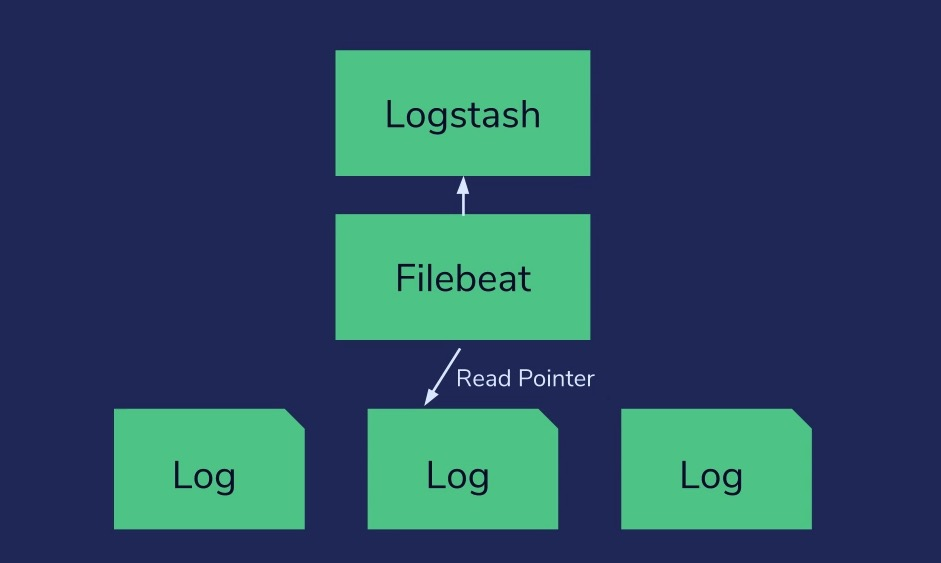

# FileBeat


## install

https://www.elastic.co/guide/en/beats/filebeat/current/filebeat-installation-configuration.html

```
sudo apt-get update && sudo-get install filebeat

sudo /bin/systemctl stop elasticsearch.service
sudo /bin/systemctl start elasticsearch.service

cd /etc/filebeat/modules.d
sudo mv apache.yml.disabled apache.yml
```

Edit apache.yml, add paths:

```yml
- module: apache
  # Access logs
  access:
    enabled: true

    # Set custom paths for the log files. If left empty,
    # Filebeat will choose the paths depending on your OS.
    var.paths: ["/home/student/logs/access*"]

  # Error logs
  error:
    enabled: true

    # Set custom paths for the log files. If left empty,
    # Filebeat will choose the paths depending on your OS.
    var.paths: ["/home/student/logs/error*"]
```    

```
sudo /bin/systemctl start filebeat.service
```

## check index created by filebeat
```
GET _cat/indices?v

GET /filebeat-7.10.1-2020.12.22-000001/_search 

```

### setup dashboards
```
sudo filebeat setup --dashboards
```
### check data
```
http://localhost:5601/app/discover#/?_g=(filters:!(),query:(language:kuery,query:''),refreshInterval:(pause:!t,value:0),time:(from:'2017-04-29T18:47:25.425Z',to:'2017-05-06T11:32:40.996Z'))&_a=(columns:!(_source),filters:!(),index:'filebeat-*',interval:auto,query:(language:kuery,query:''),sort:!())
```